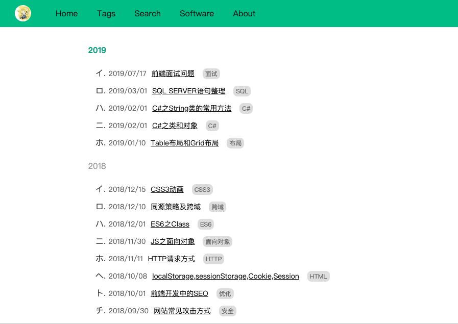
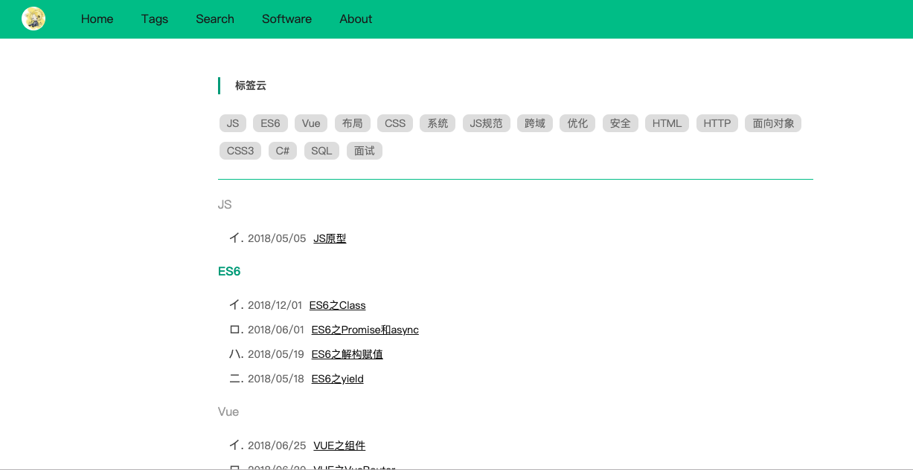
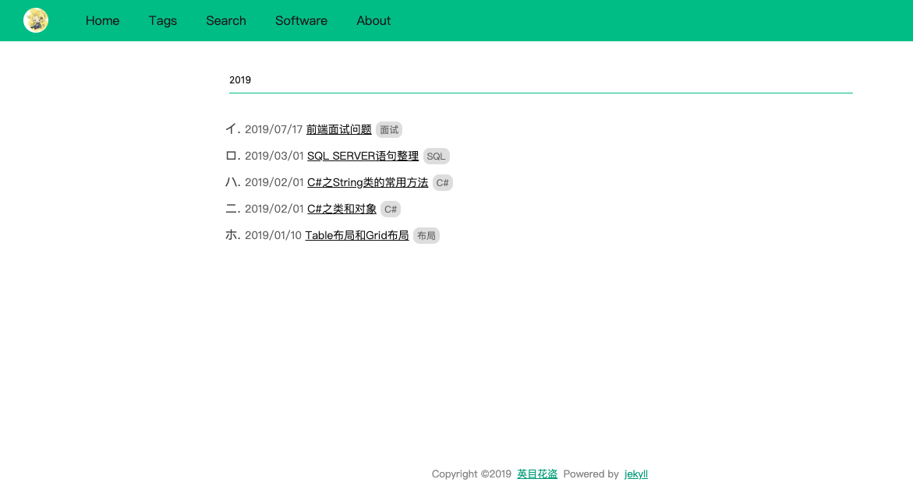
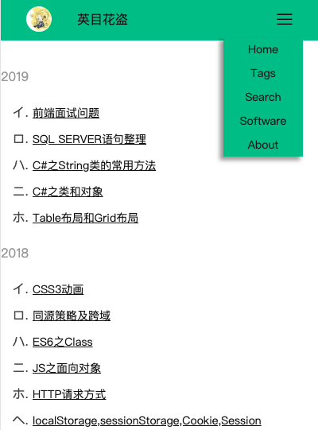
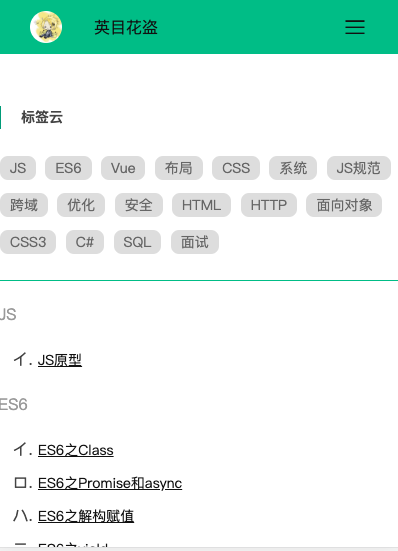

## 介绍
无框架，页面自适应，支持检索          
具体样式可进入我的博客[英目花盗的不老歌](http://www.ymhd.xyz/)查看
## 使用或修改
如果仅做使用，直接`fork`,然后修改一些配置，具体配置我会在下面详细说明。            
如果要再次开发，首先下载项目到本地，然后本地安装`jekyll`环境。打开命令行，cd到项目目录，执行命令`jekyll serve`，即可启动服务，复制地址`http://127.0.0.1:4000/`到浏览器即可访问，如果懒得配置本地环境，可以选择[cloud studio](https://studio.dev.tencent.com/)在线开发，后期也可直接在腾讯云上发布你的项目
## 文件夹属性
1. `_includes`放的页头和页脚页面
2. `_layouts`放的两个母版页
3. `_posts`放的博客内容(md文件)
4. `pages`放的菜单跳转页面
5. `posts`放的博客文件中的引用资源，比如，博客`2018-08-08-xxx.md`中引入图片
```

```
这个图片`1.jpg`的存放路径为`posts/2018/08/08/1.jpg`
6. `static`放的各种资源文件
7. `static/img/software`放的是`software`页面的展示图片          


## 使用
1. 清空`_posts`和`posts`以及`static/img/software`文件夹下的内容，然后放进你自己的内容。         

2. 文章放在`/_posts`目录下，命名为`yyyy-MM-dd-xxxx-xxxx.md`,内容格式为
```
---
layout: 母版(mypost|default)
title: 标题
tags: [标签1，标签2]
---
文章内容，MD格式
```
3. 修改`_config.yml`文件，把我的名字改成你自己的
4. 替换`static/img`下的`logo.jpg`和`favicon.ico`

## 发布
可把项目托管在`github`或者[腾讯云](https://dev.tencent.com/)上，两者都有提供`Pages服务`，可以免费发布在线上，因为国内`github`比较慢，所以我选择的是腾讯云，而且腾讯云操作也比较傻瓜式
## 注意
如果你选择项目托管于腾讯云，发布后腾讯云提供的默认网址是`xxxx.coding.me/yourBlog`,yourBlog是你的项目名称，如果想要正常访问必须配置`_config.yml`中的`baseurl`为`/yourBlog`，如果你配置了自己的域名，则不用配置
## 截图




